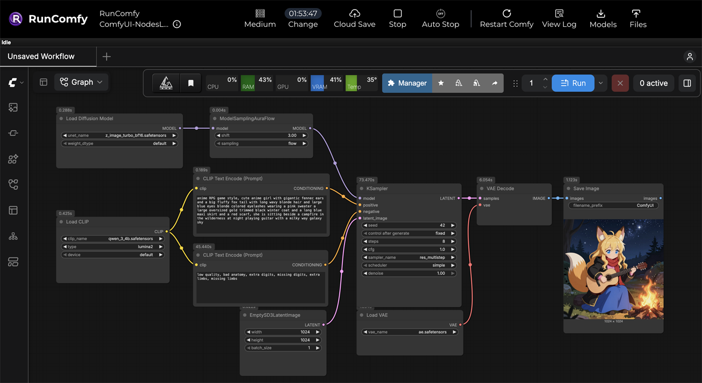
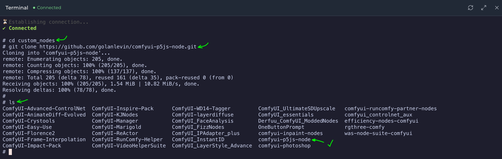
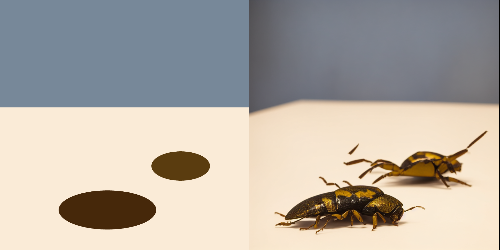
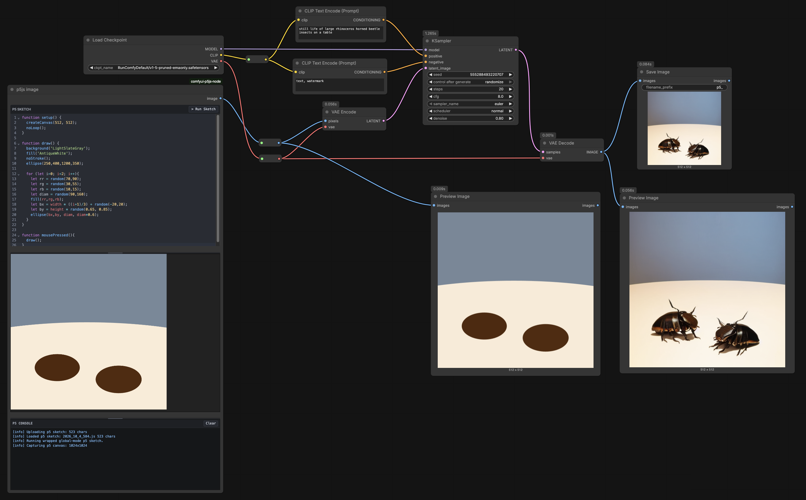
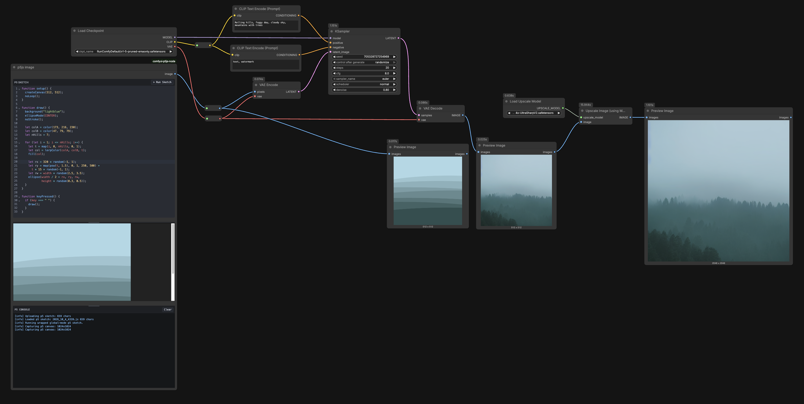

# `comfyui-p5js-node` on RunComfy

> This page presents instructions for using the `comfyui-p5js-node` in a cloud-based ComfyUI environment at RunComfy.com. RunComfy allows quick access to hundreds of different ComfyUI nodes, without the hassle and cost of installing and maintaining a dedicated machine. *These instructions are current as of October 4, 2026.*
> 
> These notes are written for classroom use: students can run ComfyUI in the cloud, install this custom node, paste in a p5.js sketch, and use the sketch image to condition a Stable Diffusion workflow.


---

## What This Node Does

`comfyui-p5js-node` is a ComfyUI node that runs a p5.js sketch in an iframe inside ComfyUI, and can feed its canvas to a ComfyUI workflow. When the workflow is queued, the node captures the p5 canvas as a temporary PNG and passes that image to the rest of the ComfyUI graph. This version of `comfyui-p5js-node` **uses p5.js version 2.3.4** from `https://cdn.jsdelivr.net/npm/p5@2.3.4/lib/p5.js`. Note that this node does not load `p5.sound`; sketches that use sound APIs or audio input are not supported by default.


## p5 Sketch Requirements

It is recommended that you **use ordinary global-mode p5.js sketches** that construct a canvas in `setup()` and render designs in a `draw()` function, e.g.:

```js
function setup() {
  createCanvas(512, 512);
}

function draw() {
  background(220);
  fill(40);
  circle(width/2, height/2, 180);
}
```

Notes: 

* The `comfyui-p5js-node` exports the image at the canvas's displayed p5 size, thus a sketch that is set up with `createCanvas(512, 512)` should produce a 512x512 image, even on high-DPI displays. The node captures p5's default canvas, which is expected to have the browser ID `defaultCanvas0`. 
* For a Stable Diffusion 1.5 image-conditioning workflow, it is recommended that you use `createCanvas(512, 512)` unless your workflow explicitly resizes the input image.
* The node should be able to cope with instance mode sketches, but this is untested, and your mileage may vary.

---

## Starting RunComfy

1. Create an account at [RunComfy.com](https://www.runcomfy.com/) and sign in.
3. Add funds if needed. A few dollars is usually enough for a short classroom exercise.
4. Navigate to [My Workflows](https://www.runcomfy.com/comfyui-workflows/my-workflows).
5. Choose a ComfyUI workflow such as **ComfyUI-NodesLoaded**, then click **Run Workflow**.
6. Launch a "Medium" Hobby machine ($0.99/hr), which is adequate for most classroom experiments.
7. Wait 3-5 minutes for the cloud machine to finish starting.

Before proceeding further, run RunComfy's default "Unsaved Workflow" once:

1. Hide the Assets panel if it blocks your view.
2. Click **Run**, and confirm that the default example generates an image.

This should take about a minute the first time. This gives students a known-good baseline before installing the custom node.




---

## Installing the Custom Node

The recommended installation path is to use RunComfy's command-line terminal.

1. Open the **Terminal** panel in RunComfy. There is a button for this on the right side of the RunComfy interface. 
2. Change directory to the ComfyUI custom nodes folder:<br/>`cd custom_nodes`
  * In the unlikely event you need to delete a previous installation, use: `rm -rf comfyui-p5js-node`. 
3. Clone this repository:<br />`git clone https://github.com/golanlevin/comfyui-p5js-node.git`
4. Verify that the node is present by listing the directory's contents: `ls`. You should see it listed among the other custom nodes:<br/>
5. Click **Restart Comfy**. It will take about 30 seconds for the machine to reconnect.
5. Hard-refresh (force reload) the browser page.
6. In the Assets browser, confirm that `Home > ComfyUI > custom_nodes > comfyui-p5js-node` exists.
7. In the ComfyUI graph, right-click and add the `p5js image` node.


## Minimal Node Test

After installing, paste this sketch into the node:

```js
function setup() {
  createCanvas(512, 512);
}

function draw() {
  background("AntiqueWhite");
  noStroke();
  fill("LightSlateGray");
  rect(0, 0, width, 220);
  fill(70, 40, 10);
  ellipse(220, 430, 200, 80);
  fill(90, 60, 15);
  ellipse(370, 340, 120, 60);
}
```

Check that:

1. **Run Sketch** shows the p5 canvas in the iframe.
2. Panning and zooming the ComfyUI canvas keeps the iframe aligned with the node.
3. Clicking and typing in the code editor does not drag the node.
4. ComfyUI's **Run** button captures the p5 canvas and passes it to the next image node.
5. A workflow with two p5 nodes captures two separate sketches correctly.


---


## Example p5 Sketches + ComfyUI Workflows 

I recommend developing and debugging sketches first in a dedicated p5.js editor such as the p5.js Web Editor, OpenProcessing, or a local editor. The ComfyUI node is best treated as the place where an already-working sketch is run inside an image-generation workflow.

### Example 1: Bugs



This repository includes example p5+Comfy workflows in [examples/](examples/), such as the following beetle example. Either the JSON or the PNG can be dragged into the RunComfy.com window to load the workflow: 

* [p5-in-comfy-workflow-bugs.json](examples/workflows/p5-in-comfy-workflow-bugs.json) — Workflow JSON
* [p5-in-comfy-workflow-bugs.png](examples/workflows/p5-in-comfy-workflow-bugs.png) — Workflow image




This p5 sketch is suitable for a first conditioning test. Try experimenting with the "Denoise" value in the KSampler — values between 0.5 and 1.0 should produce results that adhere more or less closely to the p5 canvas. 


```js
// Put this caption in the CLIP Text Encode Prompt:
// still life of large rhinoceros horned beetle insects on a table

function setup() {
  createCanvas(512, 512);
  noLoop();
}

function draw() {
  background('LightSlateGray'); 
  noStroke(); 
  fill('AntiqueWhite'); 
  ellipse(250,400,1200,350); 
  
  // Let's draw some "bugs". 
  for (let i=0; i<2; i++){
    let rr = random(60,90); 
    let rg = random(30,65); 
    let rb = random(10,45); 
    fill(rr,rg,rb); 
    let bx = width * ((i+1)/3) + random(-25,25);
    let by = height * random(0.65, 0.80); 
    let diam = random(100,150); 
    ellipse(bx,by, diam, diam*0.6); 
  }
}

function keyPressed() {
  if (key === " ") {
    draw(); 
  }
}
```

### Example 2: Foggy Landscape

This example includes an AI-based image *upscaler* which increases the resolution of the generated image.


* [p5-in-comfy-workflow-landscape.json](examples/workflows/p5-in-comfy-workflow-landscape.json)  — Workflow JSON
* [p5-in-comfy-workflow-landscape.png](examples/workflows/p5-in-comfy-workflow-landscape.png) – Workflow image



Here's the p5.js code. (It should be loaded with the workflows provided above.)

```
// Put this caption in the CLIP Text Encode Prompt:
// Rolling hills, foggy day, cloudy sky, mountains with trees

function setup() {
  createCanvas(512, 512);
  noLoop();
}

function draw() {
  background("lightblue");
  ellipseMode(CENTER);
  noStroke();

  let colA = color(173, 216, 230);
  let colB = color(47, 79, 79);
  let nHills = 7;

  for (let i = 1; i <= nHills; i++) {
    let t = map(i, 0, nHills, 0, 1);
    let col = lerpColor(colA, colB, t);
    fill(col);

    let rx = 320 * random(-1, 1);
    let ry = map(pow(t, 1.5), 0, 1, 250, 500) +  
      t * 15 * random(-1, 1);
    let rw = width * random(2.5, 3.5);
    ellipse(width / 2 + rx, ry, rw, 
            height * random(0.3, 0.5));
  }
}

function keyPressed() {
  if (key === " ") {
    draw();
  }
}
```